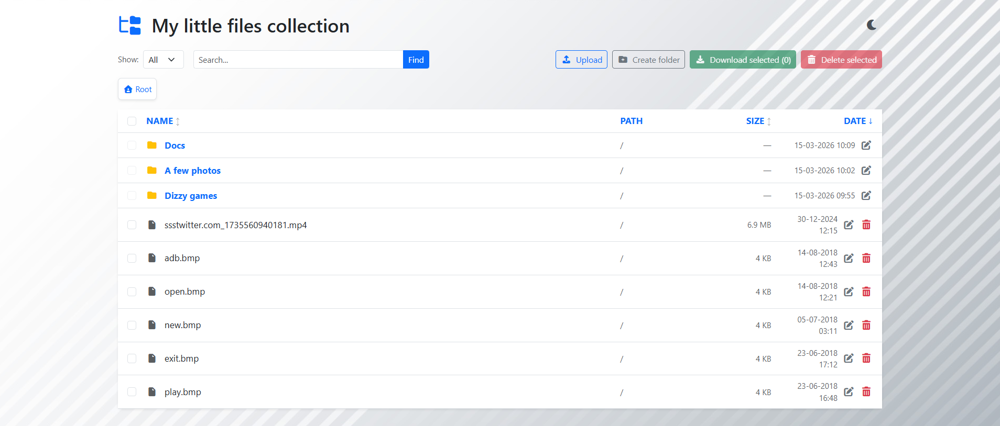
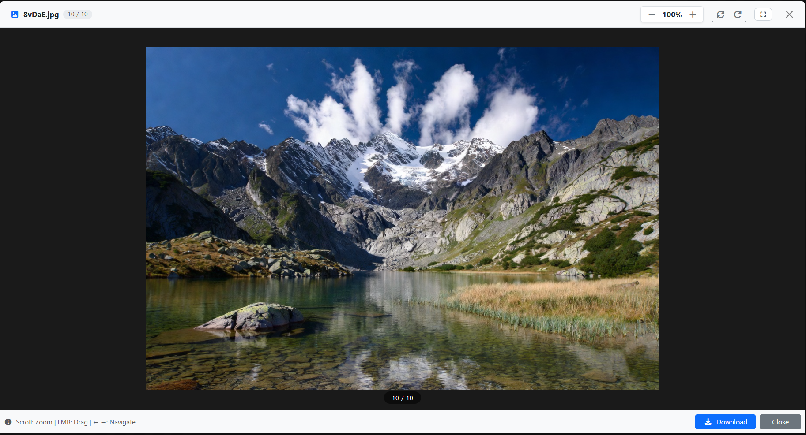
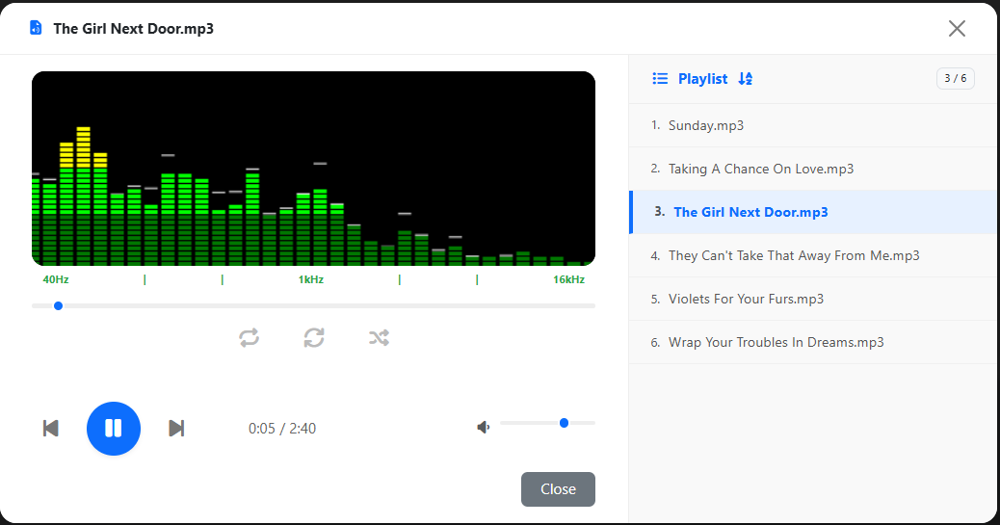
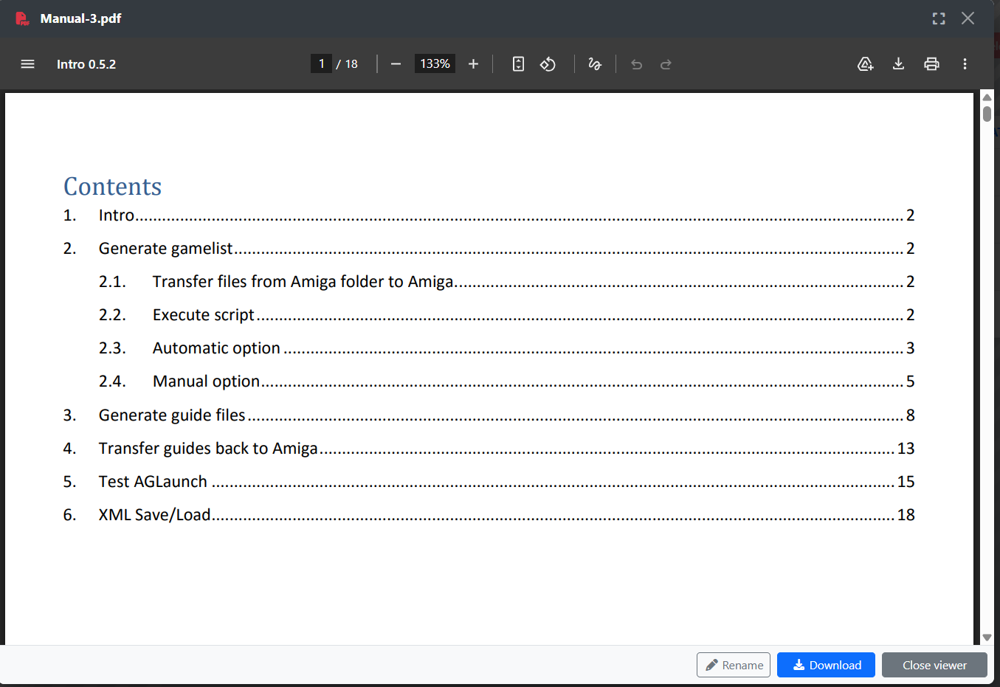
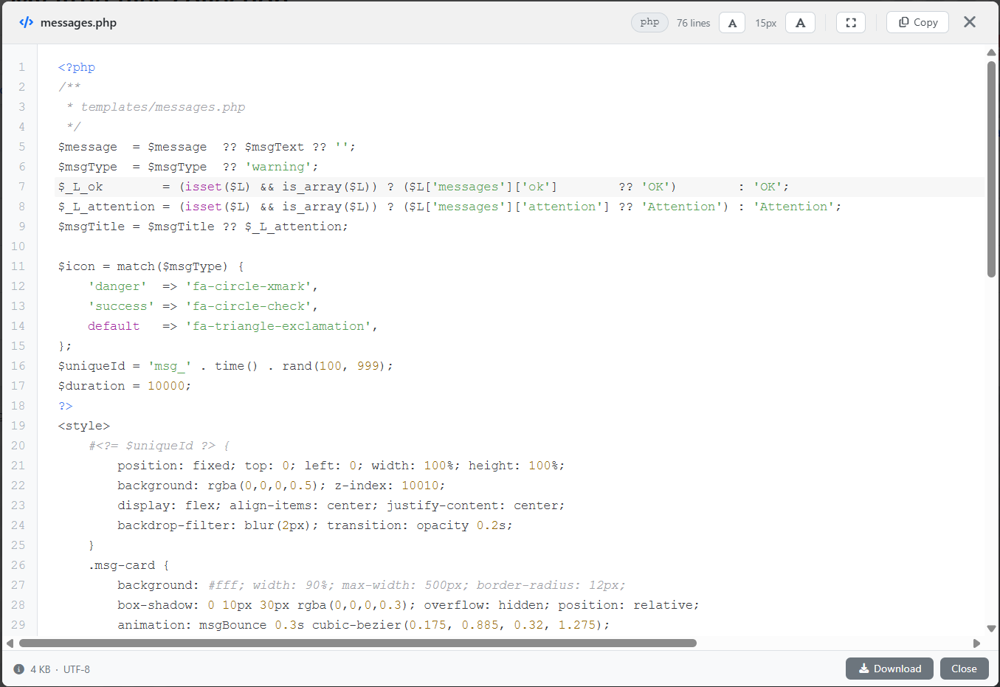
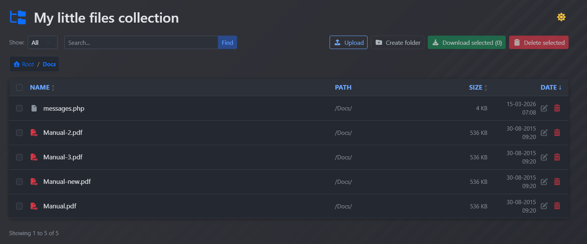

# WebFilesDesk-
Self-hosted PHP file manager with rich file previews, drag &amp; drop upload, dark theme and 21 UI languages. Runs on IIS, nginx and Apache — no database required.
# WebFilesDesk

A lightweight, self-hosted web file manager built with PHP 8.5+. Browse, preview, upload, download, rename and delete files directly from your browser — no database required.

Designed to work out of the box on **Windows Server + IIS** as well as Linux + nginx / Apache.


---

## Screenshots

> _Add your screenshots to a `/screenshots` folder and update the paths below._

| File listing | Image viewer | Audio player |
|---|---|---|
|  |  |  |

| PDF viewer | Code viewer | Dark theme |
|---|---|---|
|  |  |  |

---

## Features

- **File browsing** — sorting, pagination, search, breadcrumb navigation
- **File previews** — PDF, images (gallery with navigation), video, audio, plain text, CSV, source code with syntax highlighting
- **Audio player** — playlist mode with visualizer, repeat, shuffle
- **File operations** — upload (drag & drop), rename, delete, download, multi-select download as ZIP
- **Dark / light theme** — auto-saved per browser
- **Localization** — 21 languages, JSON-based, easy to extend
- **No database** — single configuration file (`conf.ini`)
- **IIS-ready** — includes `web.config`, tested on Windows Server 2025 + IIS 10
- **Works on** — Windows Server + IIS, Linux + nginx / Apache

---

## Why WebFilesDesk on IIS?

Most PHP file managers are built and tested exclusively on Linux + Apache/nginx. **WebFilesDesk is different** — it was developed and runs in production on **Windows Server 2025 + IIS 10**, so you get:

- ✅ Correct path handling on Windows (`\` vs `/`)
- ✅ Correct encoding detection for Windows-1251 / CP866 files
- ✅ `web.config` included and ready to use
- ✅ IIS-specific hints in error messages (which service to restart, etc.)
- ✅ No dependency on Linux-only shell commands

---

## Quick Start — 3 Steps

> No build tools, no npm, no Docker. Just PHP.

**Step 1 — Download and install dependencies**

```bash
git clone https://github.com/your-username/WebFilesDesk.git
cd WebFilesDesk
composer require scrivo/highlight.php
```

**Step 2 — Configure**

```bash
cp config/conf.ini.example config/conf.ini
```

Edit `config/conf.ini` — set the path to your files and the language:

```ini
[general]
base_dir = C:/Work/files        ; or /var/www/files on Linux
title    = My Files
language = en
```

**Step 3 — Open in browser**

Point your web server to the project folder and open it. That's it.

---

## Requirements

- PHP 8.5+
- Extensions: `mbstring`, `fileinfo`, `iconv`, `zip`, `gd`
- Web server: **IIS 10+**, nginx, or Apache
- Composer (for syntax highlighting via `scrivo/highlight.php`)

---

## Web Server Setup

### IIS (Windows Server)

1. Copy the project to your IIS site root (e.g. `C:\inetpub\wwwroot\WebFilesDesk`)
2. The included `web.config` handles URL routing automatically — no extra configuration needed
3. In `php.ini`, set upload limits to match `max_upload_size` in `conf.ini`:

```ini
upload_max_filesize = 100M
post_max_size       = 100M
```

4. In `nginx.conf` or IIS request filtering, set `maxAllowedContentLength` accordingly
5. Restart IIS and PHP

### nginx

```nginx
client_max_body_size 100M;

location / {
    try_files $uri $uri/ /index.php?$query_string;
}
```

### Apache

The included `.htaccess` handles rewrites automatically.

---

## Configuration Reference

All settings are in `config/conf.ini`.

### [general]

| Key | Default | Description |
|-----|---------|-------------|
| `base_dir` | _(required)_ | Absolute path to the root directory to browse |
| `title` | `File Manager` | Page title shown in the header |
| `language` | `en` | UI language code (see supported languages below) |
| `date_format` | `d-m-Y H:i` | Date format for file modification times (PHP date format) |
| `background` | _(empty)_ | Path to a background image relative to project root |

### [options]

| Key | Default | Description |
|-----|---------|-------------|
| `enable_search` | `true` | Enable file search |
| `enable_download` | `true` | Allow file downloads |
| `enable_upload` | `false` | Allow file uploads |
| `enable_delete` | `false` | Allow file deletion |
| `max_upload_size` | `0` | Maximum upload size, e.g. `10MB`, `1GB`. `0` = no limit |
| `debug` | `false` | Show PHP errors and config warnings |

### [exclude]

| Key | Default | Description |
|-----|---------|-------------|
| `patterns` | _(empty)_ | Comma-separated list of file/folder name patterns to hide, e.g. `*.exe, .git, Thumbs.db` |

---

## Localization

The UI language is set via `language` in `conf.ini`. Language files are in `includes/lang/`.

### Supported languages (21)

| Code | Language | Code | Language | Code | Language |
|------|----------|------|----------|------|----------|
| `en` | English | `ru` | Russian | `de` | German |
| `fr` | French | `es` | Spanish | `it` | Italian |
| `pl` | Polish | `pt` | Portuguese | `nl` | Dutch |
| `da` | Danish | `no` | Norwegian | `sv` | Swedish |
| `fi` | Finnish | `cs` | Czech | `sk` | Slovak |
| `hu` | Hungarian | `ro` | Romanian | `uk` | Ukrainian |
| `be` | Belarusian | `el` | Greek | `tr` | Turkish |

### Adding a new language

1. Copy `includes/lang/en.json` to `includes/lang/xx.json`
2. Translate all values — do not change the keys
3. Set `language = xx` in `conf.ini`

---

## Project Structure

```
WebFilesDesk/
├── config/
│   └── conf.ini              # Configuration file
├── includes/
│   ├── config.php            # Config loader
│   ├── functions.php         # Preview functions
│   ├── directory.php         # Directory listing
│   ├── download.php          # File download handler
│   ├── lang.php              # Localization loader
│   ├── styles.css            # Main stylesheet
│   └── lang/
│       ├── en.json           # English strings
│       └── ru.json           # Russian strings (+ 19 more)
├── templates/
│   ├── header.php
│   ├── footer.php
│   ├── listing.php
│   ├── messages.php
│   ├── edit_name.php
│   ├── preview_pdf.php
│   ├── preview_txt.php
│   ├── preview_csv.php
│   ├── preview_img.php
│   ├── preview_video.php
│   ├── preview_code.php
│   ├── preview_audio_single.php
│   └── audio_player.php
├── vendor/                   # Composer dependencies
├── bootstrap/                # Bootstrap CSS/JS (local)
├── fontawesome/              # Font Awesome (local)
├── web.config                # IIS configuration
└── index.php                 # Entry point
```

---

## Third-party Libraries

| Library | Version | License | Purpose |
|---------|---------|---------|---------|
| [Bootstrap](https://getbootstrap.com) | 5.x | MIT | UI framework |
| [Font Awesome](https://fontawesome.com) | 6.x | Free | Icons |
| [scrivo/highlight.php](https://github.com/scrivo/highlight.php) | latest | BSD-3 | Syntax highlighting |

---

## 💼 Professional Edition (Paid)

The open-source version of WebFilesDesk covers the core file browsing and preview functionality. If your project requires enterprise-grade features, a **Professional Edition** is available on a paid basis:

- 🔐 **Full authentication system** — login page, session management, password hashing
- 👥 **User management** — add, edit, and remove users via admin panel
- 🛡️ **Role-based access control** — assign per-user or per-group permissions for read, upload, rename, delete, and download
- 📋 **Audit log** — detailed session-level logging of all file operations: downloads, uploads, renames, deletions, folder creation
- ⚙️ **Admin panel** — manage users, roles, permissions, and audit logs through a web UI
- 📁 **Per-folder permissions** — restrict access to specific directories per user or group

To inquire about the Professional Edition, please open an issue or contact via the email in the profile.

---

## License

This project is licensed under the [MIT License](LICENSE).

---

## Contributing

Pull requests are welcome. For major changes, please open an issue first to discuss what you would like to change.

1. Fork the repository
2. Create your feature branch: `git checkout -b feature/my-feature`
3. Commit your changes: `git commit -m 'Add my feature'`
4. Push to the branch: `git push origin feature/my-feature`
5. Open a Pull Request
